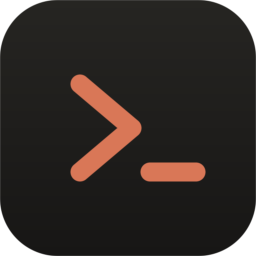

# Claude Code on Unraid

Anthropic's [Claude Code](https://claude.com/claude-code) CLI, packaged as a persistent
toolbox container for Unraid. Open a terminal, type `claude`, and work on your server's
files the same way you would on your own machine.



## Why a container at all?

Unraid boots from flash and rebuilds its root filesystem in RAM on every start. Anything
you `npm install -g` on the host is gone at the next reboot unless you hand-write it into
`/boot/config/go`. A container is the durable way to keep a CLI tool — and its login —
installed on Unraid.

The trade-off is that Claude Code is an interactive TUI, not a daemon. So this container
doesn't "serve" anything; it idles, holding a ready-to-use environment you attach to. That's
the same pattern Unraid users already use for dev shells, and it's a good fit here.

**If you'd rather not run a container**, see [Alternatives](#alternatives) at the bottom.

## What this fixes

This started from [treyg's gist](https://gist.github.com/treyg/22c4c7b0b0996c125832a69c8f75b86f),
which gets the idea right. The differences:

| | Gist | This image |
|---|---|---|
| **Login persistence** | Not persisted — re-authenticate after every restart | `~/.claude.json` lives in appdata and survives restarts, updates and reboots |
| **Install** | `npm install -g` on every container start | Baked into the image; starts instantly and works when npm is down |
| **Wrapper script** | Must be recreated by hand after each restart | Not needed; `claude` is on `PATH` |
| **File access** | Suggests the filesystem MCP server | Not needed — Claude Code reads mounted paths natively |
| **File ownership** | Everything root-owned | `nobody:users` (99:100) by default, like the rest of your array |
| **Base image** | `node:20-alpine` (musl) | `node:22-bookworm-slim` (glibc) |
| **Toolbox** | Node only | git, ripgrep, fd, jq, rsync, python3, ssh, less, nano |

The musl point is worth expanding: Claude Code ships prebuilt native helpers compiled
against glibc. On Alpine they mostly work and then fail in confusing ways. Debian avoids it.

The filesystem-MCP point too: Claude Code reads and writes files through its own built-in
tools. Any host path you bind-mount is directly usable. The MCP server adds a hop and
another permission surface for no benefit here.

## Install

### Option A — Unraid template (recommended)

1. Docker tab → **Add Container**.
2. Paste this into **Template** at the top:
   ```
   https://raw.githubusercontent.com/adman234/claude-unraid-docker/main/unraid/claude-code.xml
   ```
3. Review the paths (see [Access](#access-what-claude-can-reach)), then **Apply**.

### Option B — Docker Compose Manager

Create a stack named `claude-code`, paste in [`docker-compose.yml`](docker-compose.yml),
and Compose Up.

### Option C — build it yourself

```bash
git clone https://github.com/adman234/claude-unraid-docker
cd claude-unraid-docker
docker build -t claude-code-unraid .
```

## First run

1. Docker tab → click the **claude-code** icon → **Console**.
   (Or from an Unraid terminal: `docker exec -it claude-code claude-code`.)
2. Type `claude`.
3. Run `/login` and follow the browser prompt. **This is a one-time step** — the
   credential is written to `/mnt/user/appdata/claude-code` and reused from then on.

If you'd rather bill to an Anthropic Console API key than sign in with your subscription,
set `ANTHROPIC_API_KEY` in the template instead and skip `/login`.

## Access: what Claude can reach

By default the container mounts **`/mnt/user` read-write at the same path it has on the
host**. That's deliberate — it means a path like `/mnt/user/media/movies` works verbatim
inside the container, so you can paste paths back and forth without translating them.

It also means Claude Code can read and modify **every user share**. That's what "as if it's
installed on my PC" implies, but decide if you want it. To narrow the blast radius, replace
that single mount with only what you need:

```yaml
- /mnt/user/appdata/claude-code:/home/claude:rw   # keep this one
- /mnt/user/claude-workspace:/workspace:rw        # and this one
- /mnt/user/projects:/mnt/user/projects:rw        # writable
- /mnt/user/media:/mnt/user/media:ro              # read-only
```

Claude Code also asks before each write or command by default. Leave that on. If you
disable permission prompts (`--dangerously-skip-permissions`), the mounts above are the
only thing standing between an agent and your array — so narrow them first if you plan to.

**On the Docker socket:** the template exposes it as an optional, empty-by-default,
read-only mount. Anything that can write to `/var/run/docker.sock` can start a privileged
container and is therefore root on your host. Read-only is enough to inspect containers and
is much safer. Don't mount it read-write unless you've thought it through.

## Configuration

| Variable | Default | What it does |
|---|---|---|
| `PUID` / `PGID` | `99` / `100` | Ownership of files Claude creates. Unraid's `nobody:users`. |
| `UMASK` | `022` | Set `000` for group/other-writable files. |
| `TZ` | — | e.g. `Europe/London`. Keeps timestamps and Claude's notion of "today" right. |
| `ANTHROPIC_API_KEY` | — | Optional. Use API-key auth instead of `/login`. |
| `CLAUDE_UPDATE_ON_START` | `false` | `true` npm-updates on each start. Makes startup depend on npm. |
| `RUN_AS_ROOT` | `false` | `true` skips dropping privileges. Files become root-owned. |
| `CLAUDE_USER` | `claude` | Name of the in-container user. Rarely worth changing. |

### Paths

| Container | Purpose |
|---|---|
| `/home/claude` | Login, settings, history. **Must** be persisted. |
| `/workspace` | Default working directory. |
| `/mnt/user` | Your shares, at their real paths. |

## Updating

Pull a newer image from the Unraid Docker tab (or `docker compose pull && docker compose up -d`).
`:latest` is rebuilt weekly by CI, so it tracks upstream releases without anyone remembering to.

For a one-off update between image pulls:

```bash
docker exec -u 0 -it claude-code claude-update
```

That lasts until the container is recreated; pulling the image is the durable path.

Claude Code's own auto-updater is disabled on purpose (`DISABLE_AUTOUPDATER=1`) — it writes
into `/usr/local/lib`, which is inside the image layer and is discarded on recreate, so
letting it run just produces updates that silently vanish.

## Making it one word to type

From an Unraid terminal, add this to `/boot/config/go` so it survives reboots:

```bash
echo "alias claude='docker exec -it claude-code claude-code'" >> /root/.bash_profile
```

Then `claude` works from any Unraid SSH session or web terminal.

## Troubleshooting

**Files come out owned by `root`.** `RUN_AS_ROOT` is set, or you started Claude with
`docker exec ... claude` instead of `claude-code`. The `claude-code` wrapper drops
privileges; the bare binary doesn't.

**"detected dubious ownership" from git.** Should be handled automatically
(`safe.directory=*` is set at startup). If you see it, the persistent home probably isn't
mounted — check that `/home/claude` maps somewhere.

**Login doesn't stick across restarts.** `/home/claude` isn't persisted. Verify the appdata
mapping exists and that `/mnt/user/appdata/claude-code/.claude.json` appears after `/login`.

**Terminal rendering is garbled.** Attach with a real TTY (`docker exec -it`, note the `-t`).
The Unraid console button does this for you.

**Claude can't see a share.** It isn't mounted. Bind-mounts are not live — adding a share
requires editing the container config and restarting.

## Alternatives

A container isn't the only answer, and depending on what you actually want, it may not be
the best one:

- **Run Claude Code on your PC against a network mount.** Mount the Unraid share over SMB
  or NFS and point Claude at it. Better editor integration, no container to maintain. But
  it's slow over the network on large repos, and Claude can't run commands *on* the server —
  no `docker`, no disk tooling, no looking at what's actually running. Good for editing
  files that happen to live on the NAS; bad for administering the NAS.

- **Install Node on the host via the Nerd Tools plugin.** Works, but the RAM-disk problem
  means you're maintaining `go`-file scripting, and it breaks on Unraid upgrades.

- **`code-server` or a full dev-container.** If you want an IDE on the server anyway,
  install Claude Code inside that container and skip this one. This image is the smaller
  answer when the CLI is all you need.

The container wins when you want Claude to actually operate the server, not just edit files
that live on it.

## Security notes

- Claude Code will act on whatever you mount. Mounts are the real permission boundary.
- Keep permission prompts enabled unless you've narrowed the mounts.
- The Docker socket is root-equivalent. Read-only, or not at all, unless you need it.
- `ANTHROPIC_API_KEY` is stored in the container config; on Unraid that file is
  world-readable on the flash drive. Interactive `/login` is the better default.

## License

MIT — see [LICENSE](LICENSE). Original approach adapted from
[treyg's gist](https://gist.github.com/treyg/22c4c7b0b0996c125832a69c8f75b86f).
Not affiliated with Anthropic or Lime Technology.
